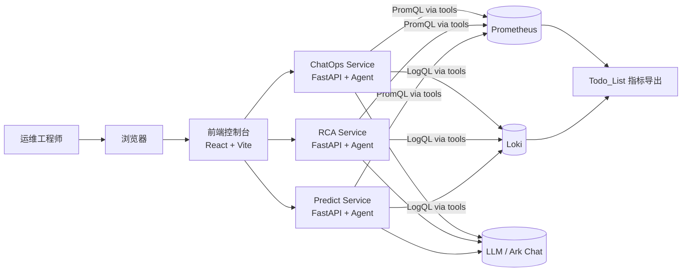
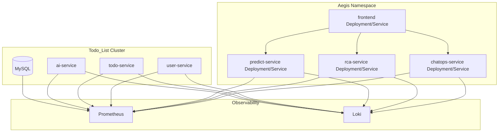

# Aegis 系统技术架构文档

版本：v1.0

---

## 1. 总体架构概览

Aegis 是一个围绕 Todo_List 项目的智能运维助手，采用“前端 + 三个后端微服务 + 外部监控系统”的分层架构。

主要组件：

- **前端控制台（frontend）**：基于 React + Vite，提供 ChatOps、RCA、Predict 三个页面。
- **后端微服务（FastAPI）**：
  - ChatOps Service：运维问答入口。
  - RCA Service：根因分析。
  - Predict Service：风险预测。
- **观测数据源**：
  - Prometheus：指标。
  - Loki：日志。
- **被监控业务系统**：
  - Todo_List 项目（user-service、todo-service、ai-service 等）。
- **LLM 提供方**：
  - 通过 LangChain 接入火山方舟 Ark Chat 模型。

### 1.1 系统架构图



---

## 2. 微服务拓扑与职责

### 2.1 拓扑图



---

## 3. 后端服务内部架构

三个微服务内部结构高度相似，均采用：

- FastAPI 负责 HTTP 层与请求校验。
- Settings + LokiClient + LLM 封装基础依赖。
- LangChain Agent + Tools 承担“智能调度”和“数据访问”职责。
- Memory 组件对会话进行简单缓存。

以 ChatOps Service 为例：

```mermaid
graph TD
    API[FastAPI 路由 /api/chatops/query] --> MAIN[main.py]
    MAIN --> LLM[get_llm()]
    MAIN --> LOKIC[LokiClient]
    MAIN --> MEM[get_memory()]
    MAIN --> TOOLS[build_tools(LokiClient)]
    MAIN --> EXEC[build_executor(LLM, TOOLS, MEM)]

    EXEC --> AGENT[LangChain AgentExecutor]
    AGENT --> T1[trace_note Tool]
    AGENT --> T2[loki_query_range_lines Tool]
    AGENT --> T3[prometheus_query_range Tool]
```

RCA 与 Predict 在工具集合上不同：

- RCA：`trace_note` + `rca_collect_evidence` + `prometheus_query_range`
- Predict：`trace_note` + `predict_collect_features` + `prometheus_query_range`

---

## 4. 关键技术点

### 4.1 LokiClient 封装

各服务的 `LokiClient` 封装了 Loki HTTP API：

- `labels()` / `label_values(label)`：获取标签及其值。
- `query_range(query, start, end, limit, direction, step_seconds)`：
  - 通过 `/loki/api/v1/query_range` 获取日志流。
  - 返回 `LokiQueryResult`，支持 `flatten_log_lines()` 等辅助方法。
- `query_instant(query, at)`：瞬时查询接口。

### 4.2 Prometheus 查询工具

`prometheus_query_range` 工具在三服务中基本一致：

- 入参：`promql`, `start_iso`, `end_iso`, `step`。
- 内部将 ISO8601 时间解析为 UTC datetime，构造 /api/v1/query_range 请求。
- 增加了错误防护：
  - 时间解析异常 → 返回 `{"error": "invalid_datetime", ...}`；
  - HTTP 请求异常 → 返回 `{"error": "prometheus_request_failed", ...}`。
- 正常情况下返回：

```json
{
  "promql": "...",
  "start": "...",
  "end": "...",
  "step": "60s",
  "result_type": "matrix",
  "series": [
    {
      "metric": { "service": "user-service" },
      "values": [["1700000000", "0.1"], ["1700000060", "0.2"]]
    }
  ]
}
```

### 4.3 LLM 接入

`llm.py` 中通过 LangChain 的 `ChatOpenAI` 适配火山方舟 Ark：

- 模型由 `settings.llm_model` 配置（示例：`doubao-seed-1-6-251015`）。
- 接口凭据通过 `settings.ark_api_key` / 环境变量 `ARK_API_KEY` 提供。
- 所有 Agent 均基于 `BaseChatModel` 构建。

### 4.4 Agent Prompt 设计

- ChatOps：
  - 强调“只使用 Prometheus + Loki”，引用 Todo_List 监控手册中的指标/标签约束。
  - 明确 LogQL 不能使用 `service` 作为标签，只能文本过滤。
  - 规定调用任何工具前先使用 `trace_note` 记录计划。

- RCA：
  - 引导先看 Prometheus 指标，再用 `rca_collect_evidence` 拉日志。
  - 规定输出结构化 JSON，包含 summary / suspected_service / root_cause / evidence / suggested_actions。

- Predict：
  - 引导同时利用 Prometheus 指标与错误日志特征。
  - 强调 `risk_score` 为主观概率、非精确计算。

---

## 5. 配置与部署

### 5.1 Settings 与 ConfigMap

每个服务的 `settings.py` 使用 `pydantic_settings` 从环境变量 / `.env` 中加载配置：

- Loki：
  - `loki_base_url`
  - `loki_tenant_id`（可选）
  - `loki_service_label_key`（默认 `app`）
  - `loki_selector_template`（例如 `{{{label_key}="{service}"}}`）
- Prometheus：
  - `prometheus_base_url`
- LLM：
  - `llm_model`
  - `ark_api_key`
  - `ark_base_url`

在 Kubernetes 中通过 `k8s/configmap.yaml` 与 `k8s/secret.yaml` 注入这些配置。

### 5.2 容器与部署

每个服务目录下提供：

- `Dockerfile`：构建 Python 镜像。
- `requirements.txt`：依赖列表。

`k8s/*.yaml` 中：

- 为每个服务定义 `Deployment` 与 `Service`。
- 将命名空间统一为 `aegis`，资源名采用 `aegis-xxx-service` 风格。

---

## 6. 扩展性与演进

### 6.1 新工具扩展

在任一服务中增加新功能的推荐步骤：

1. 在 `app/tools/` 下新增单文件工具（例如 `kube_events_query.py`）。
2. 在 `tools/__init__.py` 的 `build_tools` 中注册该工具。
3. 在对应 `agent/executor.py` 的系统 Prompt 中说明新工具的用途与使用场景。

### 6.2 多项目支持

未来如需支持多个业务项目，可考虑：

- 在 ConfigMap 中为每个项目配置不同的 selector 模板、命名空间约束。
- 在请求中增加“项目标识”，Agent 根据项目选择不同的模板与约束。

---

## 7. 风险与边界

- 若 Prometheus/Loki 数据质量不足（指标缺失、日志不规范），Agent 结果会受到显著影响。
- LLM 可能偶尔生成不存在的指标名或标签，系统 Prompt 已做限制，但仍需人工复核关键操作。
- 当前未内置任何变更执行能力，所有操作建议需要人工确认和实施。

